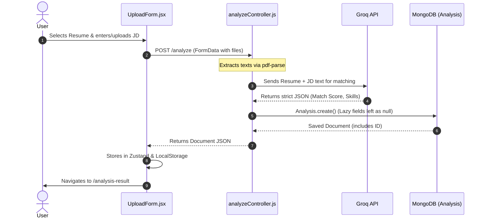
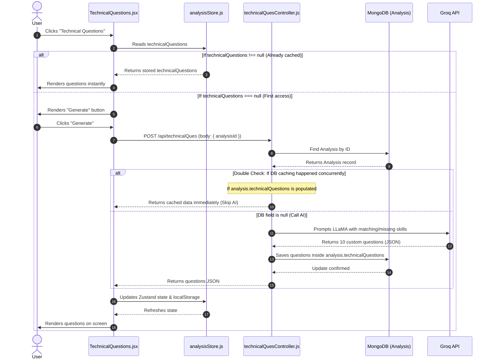

# Career Accelerator: Program Flow, Architecture & Technology Stack

This document provides an in-depth breakdown of the **SkillMatch AI (Resume to Job Description Matcher)** application. It covers the technology stack, the database models, the frontend and backend architectures, and traces the step-by-step program execution flow with visual diagrams.

---

## 🛠️ Technology Stack Breakdown

The application is built using a modern **MERN (MongoDB, Express, React, Node)** architecture, optimized for high performance, state synchronization, and secure cookie-based session management.

```
┌────────────────────────────────────────────────────────┐
│                        CLIENT                          │
│   React (Vite)  •  Zustand (State)  •  Vanilla CSS     │
└───────────────────────────┬────────────────────────────┘
                            │ (Axios with HTTP Cookies)
                            ▼
┌────────────────────────────────────────────────────────┐
│                        SERVER                          │
│   Node.js  •  Express  •  Multer  •  PDF-Parse         │
└───────────────────────────┬────────────────────────────┘
                            ├────────────────────────────┐
                            ▼                            ▼
              ┌───────────────────────────┐┌─────────────┴─────────────┐
              │         DATABASE          ││         AI ENGINE         │
              │         MongoDB         ││    Groq SDK / LLaMA 3       │
              └───────────────────────────┘└───────────────────────────┘
```

### 1. Frontend Technologies
*   **React (Vite)**: A modern web interface framework, configured via Rolldown-Vite for lightning-fast compilation, hot module replacement, and client-side page routing.
*   **Zustand**: A lightweight, hook-based state management store. It manages active resume matching results and user auth states, persisting sessions to `localStorage`.
*   **React Router DOM**: Manages client-side navigation between the Dashboard, New Analysis Form, Match Results, and the lazily generated preparation screens.
*   **Axios**: An HTTP client configured with a base URL of `http://localhost:5000/api` and `withCredentials: true` to seamlessly pass HTTP-only cookie credentials on every request.
*   **Vanilla CSS**: Used for UI styling, custom radial backgrounds, responsive grids, and clean glassmorphism card components.

### 2. Backend Technologies
*   **Node.js & Express**: Provides a robust REST API framework.
*   **Multer (Memory Storage)**: Intercepts multi-part file uploads (resumes and JDs) directly in memory buffers, avoiding slow disk-write operations.
*   **PDF-Parse & Mammoth**: Parses text dynamically from uploaded PDF and Word (.docx) documents.
*   **Groq SDK**: Interacts with high-performance LLMs (e.g., LLaMA models) to perform structured analysis, returning strict JSON payloads.
*   **JSON Web Tokens (JWT) & Cookie-Parser**: Signs user session payloads upon authentication and stores the signature in secure HTTP cookies, intercepted by API guards.

### 3. Database Layer
*   **MongoDB & Mongoose**: Houses documents for users and their analysis history. Leverages mongoose schemas to validate data, enforce relational foreign keys, and support flexible `Mixed` type caching.

---

## 📊 Database Schemas

### 1. User Schema (`backEnd/models/User.js`)
Stores authentication metadata.
```javascript
{
  name: { type: String, required: true },
  email: { type: String, required: true, unique: true },
  password: { type: String, required: true } // Bcrypt-hashed
}
```

### 2. Analysis Schema (`backEnd/models/Analysis.js`)
Maintains matching metadata and lazily stores AI outputs when requested.
```javascript
{
  user: { type: Schema.Types.ObjectId, ref: "User", required: true },
  jobRole: { type: String },
  matchPercentage: { type: Number, required: true },
  matchingSkills: { type: [String], default: [] },
  missingSkills: { type: [String], default: [] },
  improvements: { type: [String], default: [] },
  createdAt: { type: Date, default: Date.now },
  
  // Lazy-loaded properties (Cached in MongoDB upon first click)
  preparationPlan: { type: Schema.Types.Mixed, default: null },
  resources: { type: Schema.Types.Mixed, default: null },
  technicalQuestions: { type: Schema.Types.Mixed, default: null },
  behavioralQuestions: { type: Schema.Types.Mixed, default: null }
}
```

---

## 🗺️ Visual Program Flow Charts

### 1. Analysis Creation Flow (Initial Execution)
When a user uploads files, only the core match details are generated to conserve AI tokens.



---

### 2. Sub-Feature Retrieval Flow (Lazy Loading & Caching)
When a user visits a page like **Technical Questions**, the system checks if the data was already generated.



---

## 🔍 Detailed Component & Route Tracing

### 1. Dashboard Landing Flow
1.  **Component Mounting**: Upon loading `/`, [Dashboard.jsx](file:///d:/New%20folder/Pro/client/src/pages/Dashboard.jsx) triggers `fetchHistory()` inside `useEffect`.
2.  **API Hook**: An HTTP `GET` is pushed to `/api/analysis`.
3.  **Authentication Guard**: The backend router in [analysisRoutes.js](file:///d:/New%20folder/Pro/backEnd/routes/analysisRoutes.js) passes execution to `protect` (`authMiddleware.js`). It reads `req.cookies.token`, decodes the payload, finds the database User, and sets `req.user`.
4.  **Database Lookup**: The handler executes `Analysis.find({ user: req.user._id }).sort({ createdAt: -1 })`.
5.  **Status Evaluation**: The client receives the analyses array and checks the completion of sub-features on each card:
    *   If `analysis.preparationPlan !== null` $\rightarrow$ Render Checklist status as Completed (✔).
    *   If `analysis.preparationPlan === null` $\rightarrow$ Render Checklist status as Pending (✖).
6.  **Card Interactions**: Clicking a card triggers `handleCardClick(analysis)`. It executes `setResult(analysis)` inside [analysisStore.js](file:///d:/New%20folder/Pro/client/src/store/analysisStore.js), which hydates all states (`result`, `preparationPlan`, `resources`, etc.) with the selected analysis. It then redirects the router to `/analysis-result`.

### 2. Backend Caching Implementation
Each of the 4 sub-controllers ([preparationController.js](file:///d:/New%20folder/Pro/backEnd/controllers/preparationController.js), [resourceController.js](file:///d:/New%20folder/Pro/backEnd/controllers/resourceController.js), [technicalQuesController.js](file:///d:/New%20folder/Pro/backEnd/controllers/technicalQuesController.js), and [behavioralQuesController.js](file:///d:/New%20folder/Pro/backEnd/controllers/behavioralQuesController.js)) utilizes an identical execution cycle:

```javascript
// Step 1: Extract analysisId from Request Body
const { analysisId } = req.body;

// Step 2: Query DB & Assert Ownership
const analysis = await Analysis.findById(analysisId);
if (analysis.user.toString() !== req.user._id.toString()) {
    throw new ApiError(403, "Unauthorized access.");
}

// Step 3: Check Cache to avoid Groq AI fees
if (analysis.technicalQuestions) {
    return res.json(analysis.technicalQuestions); // Returns stored MongoDB data immediately
}

// Step 4: Run AI Generation & Persist
const prompt = `...`; // Builds prompt using fields stored in MongoDB
const output = await callGroq(prompt);
const result = extractJSON(output);

analysis.technicalQuestions = result;
await analysis.save(); // Cache saved for all future dashboard requests

res.json(result);
```

### 3. State & LocalStorage Synchronization
Whenever a sub-section is generated on the client side, it calls the corresponding setter in [analysisStore.js](file:///d:/New%20folder/Pro/client/src/store/analysisStore.js).
This setter merges the new sub-section data into the current active `result` object, keeping `localStorage` synchronized so page refreshes maintain the updated generated state:

```javascript
setTechnicalQuestions: (data) =>
  set((state) => {
    const updatedResult = state.result ? { ...state.result, technicalQuestions: data } : null;
    if (updatedResult) {
      localStorage.setItem("analysisResult", JSON.stringify(updatedResult));
    }
    return {
      technicalQuestions: data,
      result: updatedResult,
    };
  })
```
