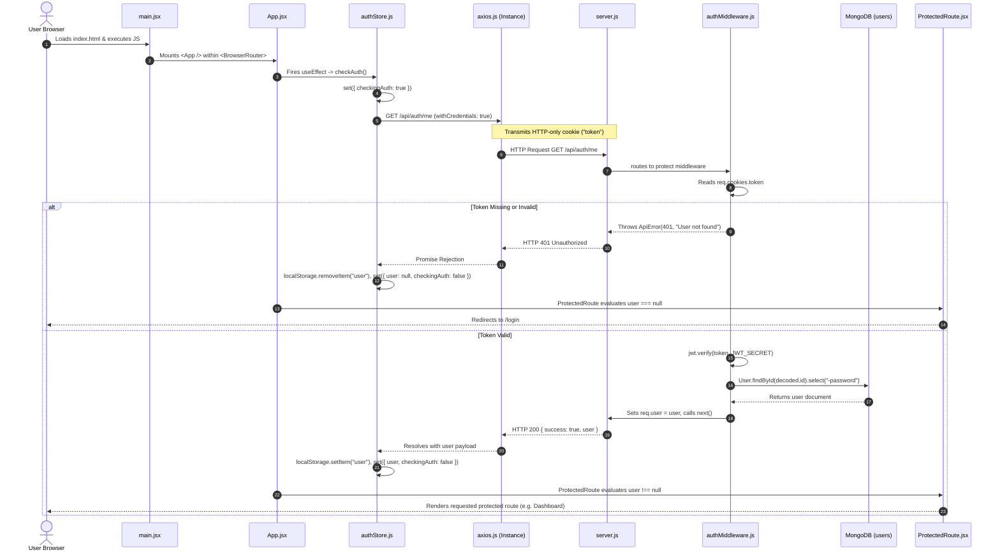
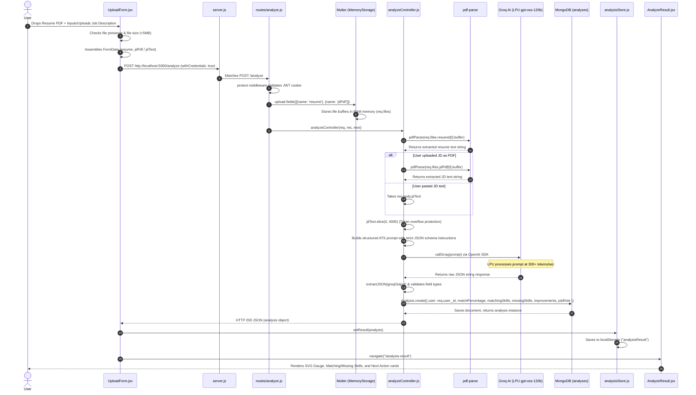
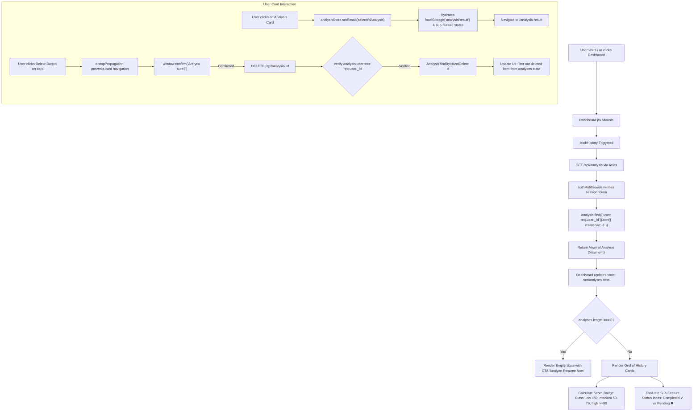
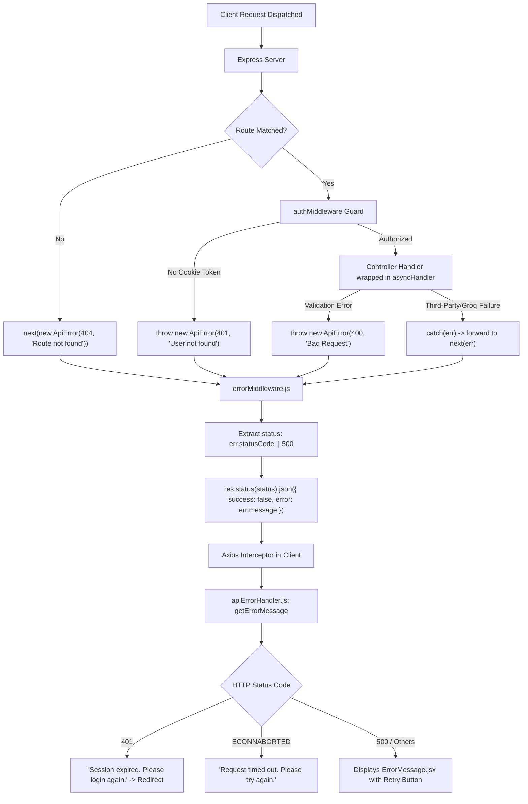

# SkillMatch AI: Complete Program Control Flow & Technology Architecture Guide

This document is the authoritative, comprehensive technical manual for the **SkillMatch AI (Resume to Job Description Matcher & Career Accelerator)** application. It explains every architectural layer, component responsibility, data pipeline, user interaction journey, underlying technology choice (with "What, Where, For What, Why, and Alternatives" breakdowns), and data model across the MERN + Groq AI ecosystem.

---

## 📑 Table of Contents

1. [High-Level System Architecture](#1-high-level-system-architecture)
2. [Technology Stack & Architectural Decisions (What, Where, Why & Alternatives)](#2-technology-stack--architectural-decisions-what-where-why--alternatives)
   - [Frontend Technologies](#frontend-technologies)
   - [Backend & Server Technologies](#backend--server-technologies)
   - [Database & Storage Layer](#database--storage-layer)
   - [AI Engine & Intelligence Layer](#ai-engine--intelligence-layer)
   - [Document Processing & Parsing](#document-processing--parsing)
   - [Security, Tokenization & Middleware](#security-tokenization--middleware)
3. [Database Schemas & Data Modeling](#3-database-schemas--data-modeling)
   - [User Schema](#user-schema-users)
   - [Analysis Schema & Lazy-Loading Architecture](#analysis-schema-analyses)
4. [Master Program Control Flow Pipelines](#4-master-program-control-flow-pipelines)
   - [Pipeline 1: Application Boot & Session Hydration](#pipeline-1-application-boot--session-hydration)
   - [Pipeline 2: User Authentication Lifecycle (Signup, Login, Logout)](#pipeline-2-user-authentication-lifecycle-signup-login-logout)
   - [Pipeline 3: Resume & Job Description Analysis (Ingestion & AI Processing)](#pipeline-3-resume--job-description-analysis-ingestion--ai-processing)
   - [Pipeline 4: Dashboard & History Management Pipeline](#pipeline-4-dashboard--history-management-pipeline)
   - [Pipeline 5: Lazy-Loaded Sub-Features & MongoDB Cache Pipelines](#pipeline-5-lazy-loaded-sub-features--mongodb-cache-pipelines)
     - [5.1 Preparation Plan Generation & Retrieval](#51-preparation-plan-generation--retrieval)
     - [5.2 Technical Questions Generation & Retrieval](#52-technical-questions-generation--retrieval)
     - [5.3 Behavioral Questions (STAR Method) Generation & Retrieval](#53-behavioral-questions-star-method-generation--retrieval)
     - [5.4 Curated Learning Resources (Deterministic Local Matching)](#54-curated-learning-resources-deterministic-local-matching)
   - [Pipeline 6: Centralized Error Handling & Boundary Guard Flow](#pipeline-6-centralized-error-handling--boundary-guard-flow)
5. [End-to-End User Interaction Flow & UI States](#5-end-to-end-user-interaction-flow--ui-states)
   - [User Journey 1: First-Time Visitor & Registration](#user-journey-1-first-time-visitor--registration)
   - [User Journey 2: Sign-in & Dashboard Landing](#user-journey-2-sign-in--dashboard-landing)
   - [User Journey 3: Resume Analysis Submission](#user-journey-3-resume-analysis-submission)
   - [User Journey 4: Analysis Result Exploration & Match Scoring](#user-journey-4-analysis-result-exploration--match-scoring)
   - [User Journey 5: Career Accelerator Exploration (Plan, Tech, Behavioral, Resources)](#user-journey-5-career-accelerator-exploration-plan-tech-behavioral-resources)
   - [User Journey 6: Dashboard Application Record Deletion](#user-journey-6-dashboard-application-record-deletion)
   - [User Journey 7: Session Expiration & Re-authentication Flow](#user-journey-7-session-expiration--re-authentication-flow)
6. [File-by-File Responsibility & Trigger Matrix](#6-file-by-file-responsibility--trigger-matrix)
   - [Backend Architecture Map](#backend-architecture-map)
   - [Frontend Architecture Map](#frontend-architecture-map)

---

## 1. High-Level System Architecture

The following diagram maps how the client single-page application interacts through an authenticated HTTP reverse proxy boundary with Node.js/Express, MongoDB, the local file system, and external Groq Cloud inference engines.

```
┌────────────────────────────────────────────────────────────────────────────────────────┐
│                                       CLIENT TIER                                      │
│                                                                                        │
│   React 19 (Vite)  •  Zustand Global Store  •  React Router DOM v7  •  Vanilla CSS     │
│   LocalStorage Cache (user, analysisResult)  •  SVG Score Gauges & Dynamic UI Badges  │
└───────────────────────────────────────────┬────────────────────────────────────────────┘
                                            │
                                            │ Axios HTTP (withCredentials: true)
                                            │ HTTP-only Cookie Transport ("token")
                                            ▼
┌────────────────────────────────────────────────────────────────────────────────────────┐
│                                    SERVER & API TIER                                   │
│                                                                                        │
│   Node.js runtime  •  Express 5.x REST API Engine                                      │
│   ├── Middleware: cookieParser, cors, authMiddleware (JWT protect), errorMiddleware    │
│   ├── Document Parsers: Multer (RAM memoryStorage), pdf-parse                          │
│   └── Route Controllers: auth, analyze, preparation, resource, technical, behavioral   │
└───────────────┬───────────────────────────┬────────────────────────────┬───────────────┘
                │                           │                            │
                │ Mongoose 9 ODM            │ HTTPS / REST (OpenAI SDK)   │ Node fs (Sync)
                ▼                           ▼                            ▼
┌───────────────────────────────┐ ┌───────────────────────────────┐ ┌───────────────────────────────┐
│        DATABASE LAYER         │ │           AI ENGINE           │ │      LOCAL DATA ENGINE        │
│                               │ │                               │ │                               │
│       MongoDB (Atlas/Local)   │ │           Groq Cloud          │ │     backEnd/data/             │
│   - collections: users        │ │   (LPU Hardware Inference)    │ │     resources.json            │
│   - collections: analyses     │ │   - Model: openai/gpt-oss-120b│ │   - 10,700+ lines curated     │
│   - ObjectId relational link  │ │   - Temperature: 0.3 (Strict) │ │     free courses & tutorials  │
└───────────────────────────────┘ └───────────────────────────────┘ └───────────────────────────────┘
```

---

## 2. Technology Stack & Architectural Decisions (What, Where, Why & Alternatives)

Below is an exhaustive breakdown of every key tool, library, middleware, protocol, and database design element used in this project. For each component, we explain **what it is**, **where it is used**, **for what purpose**, **why it was selected**, and **industry alternatives**.

### Frontend Technologies

#### 1. React 19 ([client/src/main.jsx](file:///d:/New%20folder/Pro/client/src/main.jsx))
- **What**: Declarative, component-based frontend JavaScript library.
- **Where**: Core rendering layer of the entire client-side web application.
- **For What**: Building dynamic, modular user interfaces, handling UI reactivity, hooks (`useState`, `useEffect`, `useRef`), and component lifecycle events.
- **Why**: React 19 introduces optimized reconciliation, first-class server/client support, robust TypeScript ecosystem, and wide support for modern state and routing libraries.
- **Alternatives**:
  - *Next.js / Remix*: Full-stack React frameworks with Server-Side Rendering (SSR) or Static Site Generation (SSG).
  - *Vue.js 3*: Template-based reactive framework with lower initial cognitive curve.
  - *Svelte 5*: Compiler-based UI library producing zero-runtime bundle overhead.
  - *Angular*: Full-featured enterprise framework with built-in dependency injection and RxJS.

#### 2. Vite & Rolldown-Vite ([client/vite.config.js](file:///d:/New%20folder/Pro/client/vite.config.js))
- **What**: Next-generation frontend build tool and local development server using ES modules.
- **Where**: Build and dev tooling (`npm run dev`, `npm run build`).
- **For What**: Instant dev-server cold start, lightning-fast Hot Module Replacement (HMR), and production bundling.
- **Why**: Drastically faster than legacy bundlers (Webpack) by serving native ESM during development and pre-bundling dependencies with esbuild.
- **Alternatives**:
  - *Webpack*: Industry standard for legacy projects, but slower build times and extensive configuration.
  - *Turbopack*: Rust-based incremental bundler bundled primarily with Next.js.
  - *Parcel*: Zero-config bundler, but less ecosystem flexibility compared to Vite.

#### 3. Zustand ([client/src/store/authStore.js](file:///d:/New%20folder/Pro/client/src/store/authStore.js), [client/src/store/analysisStore.js](file:///d:/New%20folder/Pro/client/src/store/analysisStore.js))
- **What**: Small, fast, scalable hook-based global state management library.
- **Where**: Client store directory; orchestrates `authStore` (user session state) and `analysisStore` (active resume match, sub-features, and history).
- **For What**: Sharing state across distant components (e.g., Navbar, Dashboard, UploadForm, AnalyzeResult) without prop-drilling, and syncing with `localStorage`.
- **Why**:
  - Requires **zero boilerplate** compared to Redux (no actions, reducers, dispatchers, or context providers).
  - Does not trigger unnecessary re-renders because components subscribe only to specific slices (`state => state.user`).
  - Does not wrap the component tree in context providers, avoiding deep DOM nesting.
- **Alternatives**:
  - *Redux Toolkit (RTK)*: Enterprise standard with strict unidirectional patterns, but heavy boilerplate.
  - *React Context API*: Built-in, but can cause performance bottlenecks as every consumer re-renders on any context change.
  - *MobX*: Object-oriented transparent reactive state management; more complex debugging.
  - *Jotai / Recoil*: Atomic state libraries suitable for fine-grained graph-like dependencies.

#### 4. React Router DOM v7 ([client/src/App.jsx](file:///d:/New%20folder/Pro/client/src/App.jsx))
- **What**: Declarative client-side routing library for React applications.
- **Where**: [App.jsx](file:///d:/New%20folder/Pro/client/src/App.jsx) and [main.jsx](file:///d:/New%20folder/Pro/client/src/main.jsx).
- **For What**: Enabling single-page application (SPA) navigation across routes (`/login`, `/signup`, `/`, `/new-analysis`, `/analysis-result`, `/resources`, `/technicalQues`, `/behavioralQues`, `/plan`) without page refreshes.
- **Why**: Allows URL synchronization, nested route structures, dynamic redirects via `<Navigate />`, and declarative route guards via `<ProtectedRoute />`.
- **Alternatives**:
  - *TanStack Router*: Fully type-safe, search-param-first routing library.
  - *Native Browser History API*: Requires building manual path matching and history listeners.
  - *Wouter*: Ultra-minimalist (1KB) routing library with subset of React Router features.

#### 5. Axios Instance with Credentials ([client/src/api/axios.js](file:///d:/New%20folder/Pro/client/src/api/axios.js))
- **What**: Promise-based HTTP client pre-configured with project defaults.
- **Where**: Used across [authStore.js](file:///d:/New%20folder/Pro/client/src/store/authStore.js), [Dashboard.jsx](file:///d:/New%20folder/Pro/client/src/pages/Dashboard.jsx), [PreparationPlan.jsx](file:///d:/New%20folder/Pro/client/src/pages/PreparationPlan.jsx), [Resources.jsx](file:///d:/New%20folder/Pro/client/src/pages/Resources.jsx), [TechnicalQuestions.jsx](file:///d:/New%20folder/Pro/client/src/pages/TechnicalQuestions.jsx), and [BehavioralQuestions.jsx](file:///d:/New%20folder/Pro/client/src/pages/BehavioralQuestions.jsx).
- **For What**: Making asynchronous REST API requests to `http://localhost:5000/api`.
- **Why**:
  - Configured with `withCredentials: true` by default, ensuring HTTP-only authentication cookies are automatically sent with every request.
  - Configured with `timeout: 60000` (60s) to handle long-running LLM generation requests gracefully.
  - Automatic JSON request serialization and response parsing.
- **Alternatives**:
  - *Native `fetch()` API*: Built into modern browsers, but requires manual boilerplate for JSON transformations, request timeouts, and error response handling.
  - *Ky*: Lightweight fetch wrapper with built-in retries.
  - *TanStack Query (React Query)*: Server-state synchronization library (best paired with Axios or Fetch for caching, deduplication, and polling).

#### 6. Vanilla CSS & Design Tokens ([client/src/index.css](file:///d:/New%20folder/Pro/client/src/index.css))
- **What**: Pure CSS stylesheets utilizing CSS custom properties (variables) for a unified design system.
- **Where**: Global stylesheet and component-level CSS files (`Home.css`, `Dashboard.css`, `AnalyzeResult.css`, `Login.css`).
- **For What**: Glassmorphic dark-theme UI, frosted-glass backdrops (`backdrop-filter: blur`), glowing score badges, responsive flex/grid layouts, and micro-animations.
- **Why**: Delivers maximum aesthetic control with zero build-step bloat or CSS framework runtime overhead.
- **Alternatives**:
  - *TailwindCSS*: Utility-first CSS framework with predefined classes; highly productive for teams but produces cluttered JSX markup.
  - *CSS Modules / Styled Components*: Scoped styling approaches preventing name collisions in very large enterprise codebases.

---

### Backend & Server Technologies

#### 1. Node.js Runtime & Express 5.x ([backEnd/server.js](file:///d:/New%20folder/Pro/backEnd/server.js))
- **What**: Asynchronous event-driven JavaScript backend runtime paired with Express.js microframework.
- **Where**: Server entry point and API controller pipeline.
- **For What**: Serving REST endpoints, parsing request payloads, managing session cookies, and orchestrating database/AI operations.
- **Why**: Express 5.x provides native async error-handling support, streamlined routing, and full compatibility with the Node.js module ecosystem.
- **Alternatives**:
  - *Fastify*: High-performance Node.js framework with schema-based compilation and lower overhead.
  - *NestJS*: Opinionated TypeScript framework using Angular-like architecture, decorators, and dependency injection.
  - *Hono / Elysia*: Modern ultra-fast runtimes targeting Bun and Cloudflare Workers.

#### 2. Cookie-Parser & CORS ([backEnd/server.js](file:///d:/New%20folder/Pro/backEnd/server.js))
- **What**: Express middlewares for cookie deserialization and Cross-Origin Resource Sharing control.
- **Where**: [server.js](file:///d:/New%20folder/Pro/backEnd/server.js#L30-L36).
- **For What**:
  - `cookieParser()` parses the HTTP `Cookie` header and populates `req.cookies.token`.
  - `cors({ origin: "http://localhost:5173", credentials: true })` permits client communication from the Vite dev server while allowing secure cookie transmission.
- **Why**: Cookies cannot cross origins without an explicit `credentials: true` CORS policy and a non-wildcard `origin`.
- **Alternatives**:
  - Manual header parsing (`req.headers.cookie.split(...)`).
  - Nginx reverse proxy serving both frontend and backend on the exact same domain/port (eliminating CORS entirely).

#### 3. Multer (Memory Storage) ([backEnd/routes/analyze.js](file:///d:/New%20folder/Pro/backEnd/routes/analyze.js))
- **What**: Streaming multipart/form-data handler for Node.js.
- **Where**: Mounted on `POST /analyze`.
- **For What**: Receiving binary resume files (`req.files.resume`) and optional JD PDF files (`req.files.jdPdf`) capped at 5MB.
- **Why**: Configured with `multer.memoryStorage()`, meaning incoming files reside solely in volatile RAM as Buffer objects (`file.buffer`). This avoids temporary disk writes, disk I/O bottlenecks, and the need for cron jobs to clean up orphaned temporary files.
- **Alternatives**:
  - *Multer DiskStorage*: Saves files to a local `uploads/` folder (requires disk cleanup and storage management).
  - *Busboy / Formidable*: Lower-level streaming parsers.
  - *Direct Cloud Upload (AWS S3 Presigned URLs / Cloudinary)*: File goes directly from browser to cloud storage bucket, bypassing the application server entirely.

---

### Database & Storage Layer

#### 1. MongoDB & Mongoose 9.x ([backEnd/config/db.js](file:///d:/New%20folder/Pro/backEnd/config/db.js))
- **What**: Distributed document-oriented NoSQL database coupled with Mongoose Object Data Modeling (ODM).
- **Where**: Configured in [db.js](file:///d:/New%20folder/Pro/backEnd/config/db.js); schemas in [models/User.js](file:///d:/New%20folder/Pro/backEnd/models/User.js) and [models/Analysis.js](file:///d:/New%20folder/Pro/backEnd/models/Analysis.js).
- **For What**: Storing user credentials, resume match analyses, skill arrays, and polymorphic AI-generated interview plans.
- **Why**:
  - AI responses produce dynamic, nested JSON trees (e.g. 7-day roadmaps, questions with variable lengths). MongoDB's flexible schema and BSON format store these directly inside `Schema.Types.Mixed` fields without complex SQL relational table migrations.
  - Native indexing, schema validation, and automatic timestamps (`createdAt`, `updatedAt`).
- **Alternatives**:
  - *PostgreSQL (with JSONB)*: Robust relational ACID database with JSON query capabilities.
  - *Prisma ORM + MySQL*: Type-safe relational model, ideal for strict relational schemas.
  - *Supabase / Firebase Firestore*: Managed backend-as-a-service platforms with built-in auth and real-time syncing.

#### 2. Local File System Database ([backEnd/data/resources.json](file:///d:/New%20folder/Pro/backEnd/data/resources.json))
- **What**: Curated offline database containing over 10,700 lines of verified educational courses.
- **Where**: [backEnd/data/resources.json](file:///d:/New%20folder/Pro/backEnd/data/resources.json), read synchronously by [resourceController.js](file:///d:/New%20folder/Pro/backEnd/controllers/resourceController.js).
- **For What**: Providing deterministic, verified course links for missing skills categorized by level (`beginner`, `intermediate`, `advanced`).
- **Why**:
  - **Zero AI Hallucinations**: LLMs frequently generate broken URLs or nonexistent courses. A curated dataset guarantees 100% valid links and real platforms (freeCodeCamp, Harvard CS50, Coursera).
  - **Instant Execution**: In-memory/filesystem parsing takes under 5ms, avoiding expensive and slow external API calls.
- **Alternatives**:
  - *YouTube Data API v3*: Real-time video search, but subject to strict daily quota limits and potential irrelevant results.
  - *Google Custom Search Engine / SerpAPI*: Live web search, but requires paid API keys and latency of 1-3 seconds.
  - *Vector Database (Pinecone, ChromaDB, Weaviate)*: Storing course embeddings for semantic matching rather than string matching.

#### 3. Client LocalStorage Caching ([client/src/store/analysisStore.js](file:///d:/New%20folder/Pro/client/src/store/analysisStore.js))
- **What**: Synchronous client-side key-value storage in the browser.
- **Where**: Persisting `user` and `analysisResult` in the browser.
- **For What**: Retaining active analysis data across page refreshes so that users do not lose their current match report when navigating between `/analysis-result`, `/resources`, and `/plan`.
- **Why**: Eliminates redundant network round-trips to the server when switching views within an active session.
- **Alternatives**:
  - *IndexedDB (via idb or Dexie.js)*: Asynchronous, handles larger data volumes (>5MB).
  - *SessionStorage*: Cleared automatically when the tab is closed; better if data should strictly not persist across tabs.

---

### AI Engine & Intelligence Layer

#### 1. Groq Cloud SDK via OpenAI Client ([backEnd/utils/groqClient.js](file:///d:/New%20folder/Pro/backEnd/utils/groqClient.js))
- **What**: Ultra-high-speed LLM inference engine powered by Groq's custom Language Processing Units (LPUs).
- **Where**: Used in [analyzeController.js](file:///d:/New%20folder/Pro/backEnd/controllers/analyzeController.js), [preparationController.js](file:///d:/New%20folder/Pro/backEnd/controllers/preparationController.js), [technicalQuesController.js](file:///d:/New%20folder/Pro/backEnd/controllers/technicalQuesController.js), and [behavioralQuesController.js](file:///d:/New%20folder/Pro/backEnd/controllers/behavioralQuesController.js).
- **For What**:
  - Evaluating resume vs. job description match percentage, missing skills, and actionable improvements.
  - Generating 7-day preparation roadmaps and skill gap severities.
  - Generating 10 role-specific technical questions (tiered: 4 Easy, 4 Medium, 2 Hard).
  - Generating 10 STAR-format behavioral interview questions with interviewer rationale and sample answers.
- **Why**:
  - **Speed**: Groq LPUs deliver inference speeds of 300-500+ tokens/second. Endpoints respond in ~1-2 seconds compared to 10-25 seconds on standard cloud GPUs.
  - **Model Quality**: Targeting `openai/gpt-oss-120b` (or LLaMA 3.3 models) provides advanced reasoning and consistent adherence to JSON-only output schemas.
  - **OpenAI Compatibility**: Using the official `openai` npm package pointing to `https://api.groq.com/openai/v1` allows switching backend AI providers simply by updating `baseURL` and `apiKey`.
- **Alternatives**:
  - *OpenAI Direct (GPT-4o / GPT-4o-mini)*: High reasoning quality, but higher cost and slower response latency.
  - *Anthropic Claude 3.5 Sonnet*: Exceptional structured reasoning and nuance; higher cost per token.
  - *Google Gemini 1.5 Flash / Pro*: Massive context window (1M+ tokens); implemented as a fallback in [geminiClient.js](file:///d:/New%20folder/Pro/backEnd/utils/geminiClient.js).
  - *Local Ollama (LLaMA 3.2 / Mistral)*: Free, self-hosted, private; requires dedicated local GPU hardware.

#### 2. Google Gemini Client Fallback ([backEnd/utils/geminiClient.js](file:///d:/New%20folder/Pro/backEnd/utils/geminiClient.js))
- **What**: Google's multimodal AI SDK (`@google/generative-ai`) targeting `gemini-1.5-flash-latest`.
- **Where**: Maintained in `backEnd/utils` as a secondary/fallback inference client.
- **For What**: Alternative AI execution engine if Groq experiences rate limits or outages.
- **Why**: Gemini 1.5 Flash provides high-speed inference with generous free-tier limits.

---

### Document Processing & Parsing

#### 1. PDF-Parse ([backEnd/controllers/analyzeController.js](file:///d:/New%20folder/Pro/backEnd/controllers/analyzeController.js))
- **What**: Pure JavaScript PDF text extraction library.
- **Where**: Ingests `req.files.resume[0].buffer` and optional `req.files.jdPdf[0].buffer`.
- **For What**: Converting raw binary PDF streams into normalized UTF-8 text strings for AI prompt synthesis.
- **Why**: Lightweight, runs purely in Node.js without requiring external binary tools like `pdftotext` or C++ build tools.
- **Alternatives**:
  - *pdfjs-dist (Mozilla)*: Comprehensive PDF rendering and extraction; larger dependency footprint.
  - *Mammoth.js*: Converts `.docx` documents into HTML/text (included in backend dependencies for Word docs).
  - *OCR Engines (Tesseract.js / AWS Textract)*: Necessary if users upload scanned images or non-selectable PDFs.

---

### Security, Tokenization & Middleware

#### 1. JSON Web Tokens (JWT) ([backEnd/controllers/authController.js](file:///d:/New%20folder/Pro/backEnd/controllers/authController.js))
- **What**: Compact, URL-safe cryptographic standard (RFC 7519) for transmitting claims between parties.
- **Where**: Generated in `authController.js` on `register` and `login`; verified in `authMiddleware.js`.
- **For What**: Stateless user authentication with a 7-day expiration (`expiresIn: "7d"`).
- **Why**: Eliminates server-side session lookup queries on every request; the signed token carries the user's ID securely.
- **Alternatives**:
  - *PASETO (Platform-Agnostic Security Tokens)*: Modern security alternative to JWT with stronger cryptographic defaults.
  - *Stateful Server Sessions (Express-Session + Redis)*: Allows instant token revocation, but requires running a Redis cluster.

#### 2. HTTP-Only, Secure, SameSite Cookies ([backEnd/controllers/authController.js](file:///d:/New%20folder/Pro/backEnd/controllers/authController.js#L56-L61))
- **What**: Secure cookie transport mechanism with browser-enforced security flags.
- **Where**: Configured on the `"token"` cookie in `authController.js`.
- **For What**: Transporting JWT tokens between browser and server.
- **Why**:
  - `httpOnly: true` ensures client-side JavaScript cannot read `document.cookie`, completely neutralizing Cross-Site Scripting (XSS) token theft.
  - `sameSite: "strict"` prevents the browser from sending the cookie in cross-site requests, mitigating Cross-Site Request Forgery (CSRF).
  - `secure: process.env.NODE_ENV === "production"` mandates HTTPS in production environments.
- **Alternatives**:
  - *Bearer Token in LocalStorage*: Vulnerable to XSS theft if any third-party script or injected dependency is compromised.
  - *In-Memory Tokens with Refresh Cookie*: Highly secure enterprise pattern (short-lived access token in JS memory + refresh token in HTTP-only cookie).

#### 3. BcryptJS ([backEnd/controllers/authController.js](file:///d:/New%20folder/Pro/backEnd/controllers/authController.js))
- **What**: Adaptive one-way password hashing function based on the Blowfish cipher.
- **Where**: Encrypting passwords on signup (`bcrypt.hash(password, 10)`) and validating passwords on login (`bcrypt.compare`).
- **For What**: Protecting user credentials against database breach leaks.
- **Why**: Salt rounds (10 iterations) introduce computational work that protects against rainbow table lookups and brute-force attacks. Pure JavaScript implementation eliminates native C++ compilation issues on Windows/Linux environments.
- **Alternatives**:
  - *Argon2 (argon2id)*: Winner of the Password Hashing Competition; memory-hard function resistant to GPU cracking.
  - *Scrypt / PBKDF2*: Standard cryptographic key derivation functions.

#### 4. Custom Error Handling Pattern ([backEnd/utils/ApiError.js](file:///d:/New%20folder/Pro/backEnd/utils/ApiError.js), [backEnd/middleware/errorMiddleware.js](file:///d:/New%20folder/Pro/backEnd/middleware/errorMiddleware.js))
- **What**: Standardized operational error class subclassing native `Error`, caught by centralized Express middleware.
- **Where**: Thrown in controllers and caught at the end of the Express middleware stack.
- **For What**: Ensuring all HTTP errors follow a uniform JSON structure: `{ success: false, error: message }`.
- **Why**: Prevents uncaught exceptions from crashing the Node.js process and standardizes API responses for the client error handler.
- **Alternatives**:
  - *`http-errors` npm package*: Popular helper for creating HTTP errors.
  - *Boom (from Hapi)*: Rich HTTP error utilities.

---

## 3. Database Schemas & Data Modeling

The database is built on MongoDB using Mongoose schemas. It follows a relational model using foreign keys (`Schema.Types.ObjectId`) combined with embedded sub-documents for AI outputs.

### User Schema (`users`)
Managed in [backEnd/models/User.js](file:///d:/New%20folder/Pro/backEnd/models/User.js).

```javascript
{
  name: {
    type: String,
    required: true,
    trim: true
  },
  email: {
    type: String,
    required: true,
    unique: true, // Unique B-Tree index preventing duplicate accounts
    lowercase: true,
    trim: true
  },
  password: {
    type: String,
    required: true // Stored as 60-character bcrypt hash
  },
  timestamps: true // Automatically generates createdAt and updatedAt fields
}
```

---

### Analysis Schema (`analyses`)
Managed in [backEnd/models/Analysis.js](file:///d:/New%20folder/Pro/backEnd/models/Analysis.js). Designed around a **Lazy-Loading Caching Architecture**: core match fields are populated immediately during resume upload, while expensive sub-features remain `null` until the user requests them.

```javascript
{
  user: {
    type: mongoose.Schema.Types.ObjectId,
    ref: "User",
    required: true,
    index: true // Indexed for rapid user history lookups: Analysis.find({ user })
  },
  matchPercentage: {
    type: Number,
    required: true,
    min: 0,
    max: 100
  },
  matchingSkills: {
    type: [String],
    default: []
  },
  missingSkills: {
    type: [String],
    default: []
  },
  improvements: {
    type: [String],
    default: []
  },
  jobRole: {
    type: String,
    default: "Software Engineer"
  },
  createdAt: {
    type: Date,
    default: Date.now
  },

  // ---------------------------------------------------------------------------
  // LAZY-LOADED & CACHED SUB-FEATURES (Default: null)
  // When a user requests a sub-feature, the server checks if the field is null.
  // If null -> Call AI / Match Data -> Save to MongoDB -> Return payload.
  // If populated -> Return directly from MongoDB (0ms AI latency, zero extra cost).
  // ---------------------------------------------------------------------------

  preparationPlan: {
    type: mongoose.Schema.Types.Mixed,
    default: null
    /* Structure when populated:
       {
         skillGaps: [{ skill: String, severity: "low"|"medium"|"high", reason: String }],
         preparationPlan: [{ day: Number, focus: String, tasks: [String] }]
       }
    */
  },

  resources: {
    type: mongoose.Schema.Types.Mixed,
    default: null
    /* Structure when populated:
       {
         resources: [{
           skill: String,
           levels: {
             beginner: [{ title, platform, url, description, duration }],
             intermediate: [...],
             advanced: [...]
           }
         }]
       }
    */
  },

  technicalQuestions: {
    type: mongoose.Schema.Types.Mixed,
    default: null
    /* Structure when populated:
       {
         questions: [{
           question: String,
           difficulty: "Easy" | "Medium" | "Hard",
           topic: String,
           answer: String
         }]
       }
    */
  },

  behavioralQuestions: {
    type: mongoose.Schema.Types.Mixed,
    default: null
    /* Structure when populated:
       {
         questions: [{
           question: String,
           whatInterviewerChecks: String,
           sampleAnswer: String
         }]
       }
    */
  }
}
```

---

## 4. Master Program Control Flow Pipelines

---

### Pipeline 1: Application Boot & Session Hydration

This pipeline executes the moment any user accesses or reloads the web application.



#### Detailed Execution Steps:
1. **Mounting**: `main.jsx` initializes `ReactDOM.createRoot` and mounts `<App />` within React Router's `<BrowserRouter>`.
2. **Session Verification Trigger**: `App.jsx` triggers `useEffect` on initial mount, invoking `checkAuth()` in [authStore.js](file:///d:/New%20folder/Pro/client/src/store/authStore.js).
3. **HTTP Dispatch**: Axios sends `GET /api/auth/me` with `withCredentials: true`. The browser automatically includes the HTTP-only `"token"` cookie.
4. **Backend Guard Verification**: Express matches `GET /api/auth/me` in [authRoutes.js](file:///d:/New%20folder/Pro/backEnd/routes/authRoutes.js) and executes `protect` middleware ([authMiddleware.js](file:///d:/New%20folder/Pro/backEnd/middleware/authMiddleware.js)).
5. **Token Verification**: Reads `req.cookies.token`. If missing or invalid, throws an `ApiError(401)`. If verified, decodes the user ID and fetches user details from MongoDB using `User.findById(decoded.id).select("-password")`.
6. **State Hydration**: On success, `authStore` updates `user` and sets `checkingAuth: false`. [ProtectedRoute.jsx](file:///d:/New%20folder/Pro/client/src/components/ProtectedRoute.jsx) renders the requested children. On failure, it clears state and redirects to `/login`.

---

### Pipeline 2: User Authentication Lifecycle (Signup, Login, Logout)

```mermaid
flowchart TD
    subgraph Registration ["1. User Registration (Signup)"]
        A1[User enters Name, Email, Password on Signup.jsx] --> B1[Form Submit Handler]
        B1 --> C1["POST /api/auth/register { name, email, password }"]
        C1 --> D1{User.findOne email}
        D1 -->|Exists| E1[Throw ApiError 400: Email already exists]
        D1 -->|Unique| F1["bcrypt.hash(password, 10)"]
        F1 --> G1["User.create({ name, email, password: hash })"]
        G1 --> H1["jwt.sign({ id }, JWT_SECRET, 7d)"]
        H1 --> I1["Set HTTP-only Cookie 'token' & Return 201"]
        I1 --> J1[Redirect User to /login]
    end

    subgraph Authentication ["2. User Login"]
        A2[User enters Email, Password on Login.jsx] --> B2[Form Submit Handler]
        B2 --> C2["POST /api/auth/login { email, password }"]
        C2 --> D2{User.findOne email}
        D2 -->|Not Found| E2[Throw ApiError 401: Invalid credentials]
        D2 -->|Found| F2["bcrypt.compare(password, user.password)"]
        F2 -->|Mismatch| E2
        F2 -->|Match| G2["jwt.sign({ id }, JWT_SECRET, 7d)"]
        G2 --> H2["Set HTTP-only Cookie 'token' & Return 200 { user }"]
        H2 --> I2["authStore.login(user) & localStorage.setItem('user')"]
        I2 --> J2[Redirect to Dashboard /]
    end

    subgraph Termination ["3. User Logout"]
        A3[User clicks Logout button in Navbar.jsx] --> B3[handleLogout Handler]
        B3 --> C3["POST /api/auth/logout"]
        C3 --> D3["res.clearCookie('token') & Return 200"]
        D3 --> E3["authStore.logout() -> clear localStorage user & analysisResult"]
        E3 --> F3[Redirect to /login]
    end
```



---

### Pipeline 3: Resume & Job Description Analysis (Ingestion & AI Processing)

This is the primary workflow of the application, taking an uploaded PDF resume and a job description (PDF or text), extracting raw text in RAM, querying Groq's high-speed LPU inference engine, saving the analysis record in MongoDB, and updating the client state.



---

### Pipeline 4: Dashboard & History Management Pipeline

Manages the retrieval, inspection, and deletion of past resume analyses.



---

### Pipeline 5: Lazy-Loaded Sub-Features & MongoDB Cache Pipelines

To optimize performance and minimize AI token costs, secondary features are **lazy-loaded** and **cached in MongoDB**.

```
                           User requests Sub-Feature
                                     │
                                     ▼
                      Check Zustand Store (In-Memory)
                                     │
                   ┌─────────────────┴─────────────────┐
                   ▼                                   ▼
             Data Exists?                        Data is null?
                   │                                   │
                   ▼                                   ▼
          Render UI Immediately                Show "Generate" CTA
                                                       │
                                                       ▼
                                              User Clicks Generate
                                                       │
                                                       ▼
                                            POST /api/[sub-feature]
                                                       │
                                                       ▼
                                            Check MongoDB Document
                                                       │
                                     ┌─────────────────┴─────────────────┐
                                     ▼                                   ▼
                               Cache Hit?                           Cache Miss?
                         (Field !== null in DB)                 (Field === null in DB)
                                     │                                   │
                                     ▼                                   ▼
                         Return Stored DB Data                  Execute Generation Logic:
                                     │                          - AI: Groq (Plan, Tech, Behavioral)
                                     │                          - Local: resources.json (Resources)
                                     │                                   │
                                     │                                   ▼
                                     │                          Save Result to MongoDB
                                     │                                   │
                                     └─────────────────┬─────────────────┘
                                                       │
                                                       ▼
                                            Client Receives Payload
                                                       │
                                                       ▼
                                           Update Zustand & LocalStorage
                                                       │
                                                       ▼
                                            Render Feature Interface
```

---

#### 5.1 Preparation Plan Generation & Retrieval
- **Frontend File**: [client/src/pages/PreparationPlan.jsx](file:///d:/New%20folder/Pro/client/src/pages/PreparationPlan.jsx)
- **Backend File**: [backEnd/controllers/preparationController.js](file:///d:/New%20folder/Pro/backEnd/controllers/preparationController.js)
- **Route**: `POST /api/preparation-plan` (Protected)
- **Payload**: `{ analysisId: "<MongoDB ObjectId>" }`
- **Logic**:
  1. Locates analysis by ID and verifies `analysis.user.toString() === req.user._id.toString()`.
  2. If `analysis.preparationPlan` is already populated in the database, returns it immediately (**Cache Hit**).
  3. If missing, takes `analysis.missingSkills` and builds a prompt instructing Groq AI to act as a career mentor.
  4. Groq generates a structured JSON object containing:
     - `skillGaps`: array of `{ skill, severity ("low"|"medium"|"high"), reason }`.
     - `preparationPlan`: 7-day array of `{ day, focus, tasks: [] }`.
  5. Updates document (`analysis.preparationPlan = result; await analysis.save()`).
  6. Client updates Zustand store and renders the 7-day roadmap with severity color borders.

---

#### 5.2 Technical Questions Generation & Retrieval
- **Frontend File**: [client/src/pages/TechnicalQuestions.jsx](file:///d:/New%20folder/Pro/client/src/pages/TechnicalQuestions.jsx)
- **Backend File**: [backEnd/controllers/technicalQuesController.js](file:///d:/New%20folder/Pro/backEnd/controllers/technicalQuesController.js)
- **Route**: `POST /api/technicalQues` (Protected)
- **Payload**: `{ analysisId: "<MongoDB ObjectId>" }`
- **Logic**:
  1. Verifies ownership and checks for cached `analysis.technicalQuestions`.
  2. If null, constructs an engineering interviewer prompt containing `jobRole`, `matchingSkills`, and `missingSkills`.
  3. Demands exactly 10 questions structured as:
     - 70% weighted toward missing skills (addressing skill gaps).
     - 30% weighted toward existing skills (confirming strengths).
     - Difficulty distribution: **4 Easy**, **4 Medium**, **2 Hard**.
  4. Groq returns `{ questions: [{ question, difficulty, topic, answer }] }`.
  5. Caches output in MongoDB and updates client state.

---

#### 5.3 Behavioral Questions (STAR Method) Generation & Retrieval
- **Frontend File**: [client/src/pages/BehavioralQuestions.jsx](file:///d:/New%20folder/Pro/client/src/pages/BehavioralQuestions.jsx)
- **Backend File**: [backEnd/controllers/behavioralQuesController.js](file:///d:/New%20folder/Pro/backEnd/controllers/behavioralQuesController.js)
- **Route**: `POST /api/behavioralQues` (Protected)
- **Payload**: `{ analysisId: "<MongoDB ObjectId>" }`
- **Logic**:
  1. Verifies ownership and checks for cached `analysis.behavioralQuestions`.
  2. If null, sends a hiring manager prompt using `jobRole` and resume `improvements`.
  3. Generates 10 behavioral questions covering leadership, adaptability, teamwork, ownership, and conflict resolution.
  4. Each question contains:
     - `question`: The interview question.
     - `whatInterviewerChecks`: The psychological/competency intent behind the question.
     - `sampleAnswer`: An interview-ready response modeled on the **STAR** framework (Situation, Task, Action, Result).
  5. Saves to MongoDB and updates client state.

---

#### 5.4 Curated Learning Resources (Deterministic Local Matching)
- **Frontend File**: [client/src/pages/Resources.jsx](file:///d:/New%20folder/Pro/client/src/pages/Resources.jsx)
- **Backend File**: [backEnd/controllers/resourceController.js](file:///d:/New%20folder/Pro/backEnd/controllers/resourceController.js)
- **Route**: `POST /api/resources` (Protected)
- **Payload**: `{ analysisId: "<MongoDB ObjectId>" }`
- **Logic**:
  1. Checks if `analysis.resources` is already cached in MongoDB.
  2. If not, reads [backEnd/data/resources.json](file:///d:/New%20folder/Pro/backEnd/data/resources.json) using `fs.readFileSync`.
  3. Iterates over `analysis.missingSkills`. For each missing skill:
     - Performs a case-insensitive exact match against `course.skill_names`.
     - If no exact match is found, performs a bidirectional substring search (`skill.includes(name) || name.includes(skill)`).
  4. Collects matched courses grouped into 3 difficulty tiers: **Beginner**, **Intermediate**, and **Advanced**.
  5. Saves structured results to MongoDB and renders course cards with platform badges, estimated durations, and direct links.

---

### Pipeline 6: Centralized Error Handling & Boundary Guard Flow



---

## 5. End-to-End User Interaction Flow & UI States

### User Journey 1: First-Time Visitor & Registration
1. **Landing**: User visits `http://localhost:5173/`.
2. **Session Guard**: `App.jsx` mounts, `ProtectedRoute` triggers `checkAuth()`. No token cookie exists.
3. **Redirection**: User is smoothly redirected to `/login`.
4. **Navigation to Signup**: User clicks "Don't have an account? Create one" navigating to `/signup`.
5. **Form Submission**:
   - User enters Full Name, Email, and Password.
   - Form inputs use controlled React state (`form.name`, `form.email`, `form.password`).
   - Clicks "Sign Up". A loading state is triggered.
   - On success, an alert confirms registration, and the user is redirected to `/login`.

### User Journey 2: Sign-in & Dashboard Landing
1. **Credentials Entry**: User enters registered email and password in [Login.jsx](file:///d:/New%20folder/Pro/client/src/pages/Login.jsx).
2. **Server Verification**:
   - `POST /api/auth/login` verifies user presence and compares password hash with `bcrypt.compare`.
   - On match, backend signs a 7-day JWT and sets the `token` HTTP-only cookie.
3. **State Hydration**:
   - Client receives user profile JSON.
   - Form state is sanitized and cleared.
   - `authStore.login(user)` updates global Zustand state and synchronizes `localStorage.setItem("user")`.
4. **Navigation**: User is routed to the root path `/` ([Dashboard.jsx](file:///d:/New%20folder/Pro/client/src/pages/Dashboard.jsx)).

### User Journey 3: Resume Analysis Submission
1. **Navigate to Upload**: From the Dashboard, user clicks the "+ New Match" button in the Navbar or "Analyze New Resume" in the header, navigating to `/new-analysis`.
2. **Resume Dropzone Interaction**:
   - User drags and drops a PDF resume into the left dropzone (or clicks to open the OS file browser).
   - Drag-over triggers visual border transitions (`drag-active`).
   - Once dropped, the zone switches to file preview mode, displaying the file name, calculated size in KB, and a clear (X) button.
3. **Target Job Description Selection**:
   - **Option A**: Drop a PDF/DOCX file of the job description into the right dropzone.
   - **Option B**: Paste raw job description text into the auto-expanding textarea below.
4. **Initiating Analysis**:
   - User clicks the primary button "Analyze & Match".
   - Client sets `loading = true`. The button displays a spinning SVG loader with label "Analyzing Profile...".
   - An authenticated multipart request is sent to `POST /analyze`.
   - The backend processes the document through Multer and `pdf-parse`, truncates JD text to 4,000 characters, queries Groq, and creates an `Analysis` record in MongoDB.
   - On response, `analysisStore.setResult(data)` stores the result, and the app navigates to `/analysis-result`.

### User Journey 4: Analysis Result Exploration & Match Scoring
1. **Match Score Gauge**:
   - An SVG circular gauge animates to the calculated match percentage.
   - Dynamic color classes apply:
     - **Green (`high`)**: $\ge 80\%$ ("Strong Fit")
     - **Amber (`medium`)**: $50\% - 79\%$ ("Moderate Fit")
     - **Red (`low`)**: $< 50\%$ ("Poor Fit")
2. **Skills Comparison**:
   - **Matching Skills**: Green badges with checkmark icons showing keywords found in both documents.
   - **Missing Skills**: Red badges indicating skills required by the JD but absent from the resume.
3. **Actionable Recommendations**:
   - A timeline of numbered recommendations providing concrete resume improvement suggestions.
4. **Career Accelerator Hub**:
   - Four interactive navigation cards: **Resources**, **Technical Questions**, **Behavioral Questions**, and **Preparation Plan**.

### User Journey 5: Career Accelerator Exploration (Plan, Tech, Behavioral, Resources)
1. **Preparation Plan Flow (`/plan`)**:
   - If not yet generated, displays a card explaining the feature with a **"Generate Preparation Plan"** CTA button.
   - On click, displays `<Loading title="Building Preparation Plan" />`.
   - Groq generates a 7-day roadmap and skill gap severity matrix.
   - Renders interactive cards with colored severity indicator borders (Red for High, Yellow for Medium, Green for Low) and day-by-day task lists.
2. **Curated Resources Flow (`/resources`)**:
   - If not yet generated, displays a **"Generate Learning Resources"** CTA.
   - On click, queries `POST /api/resources`, which parses `resources.json` locally.
   - Renders 3-column layouts for each missing skill (**Beginner**, **Intermediate**, **Advanced**) with course cards containing duration badges and direct external links.
3. **Technical Interview Questions (`/technicalQues`)**:
   - Click "Generate Technical Questions".
   - Groq produces 10 questions (4 Easy, 4 Medium, 2 Hard) focused 70% on missing skills and 30% on existing skills.
   - Renders cards displaying question difficulty badges, topics, and complete answers.
4. **Behavioral Questions (`/behavioralQues`)**:
   - Click "Generate Behavioral Questions".
   - Groq produces 10 STAR-method behavioral questions.
   - Renders cards displaying interviewer intent ("What Interviewer Checks") and structured sample answers.

### User Journey 6: Dashboard Application Record Deletion
1. From the Dashboard, user locates an analysis card.
2. Clicks the trash can icon (`btn-delete`).
3. Event propagation is stopped via `e.stopPropagation()` so the card click does not navigate to `/analysis-result`.
4. Browser prompt asks: *"Are you sure you want to delete this analysis?"*.
5. On confirmation, sends `DELETE /api/analysis/:id`.
6. Backend checks user ownership and deletes the record from MongoDB.
7. Frontend updates state immediately (`setAnalyses(prev => prev.filter(item => item._id !== id))`), smoothly removing the card from the UI.

### User Journey 7: Session Expiration & Re-authentication Flow
1. If the 7-day JWT token expires while a user is interacting with the app:
2. Any subsequent protected request returns an HTTP `401 Unauthorized`.
3. The centralized error handler in [apiErrorHandler.js](file:///d:/New%20folder/Pro/client/src/utils/apiErrorHandler.js) detects `status === 401`.
4. Displays an alert: *"Session expired. Please login again."*.
5. `authStore.logout()` clears local storage and routes the user to `/login`.

---

## 6. File-by-File Responsibility & Trigger Matrix

### Backend Architecture Map

| File Path | Core Role & Technology | Trigger Mechanism / Invocation | Output / Return Value |
| :--- | :--- | :--- | :--- |
| [server.js](file:///d:/New%20folder/Pro/backEnd/server.js) | Express app bootstrap, CORS configuration, cookie parser, route mounting, centralized error binding. | Executed on start: `node server.js` / `nodemon`. | Binds HTTP server to port 5000 and connects to MongoDB. |
| [config/db.js](file:///d:/New%20folder/Pro/backEnd/config/db.js) | Mongoose MongoDB connection initializer. | Called at server startup in `server.js`. | Authenticated Mongoose connection instance. |
| [models/User.js](file:///d:/New%20folder/Pro/backEnd/models/User.js) | Mongoose schema definition for user accounts (name, email, bcrypt password hash). | Queried during registration, login, and session checks. | Mongoose `User` document model. |
| [models/Analysis.js](file:///d:/New%20folder/Pro/backEnd/models/Analysis.js) | Mongoose schema for resume analysis records and cached sub-features (`Mixed` type). | Queried during `/analyze`, dashboard listing, and sub-feature generation. | Mongoose `Analysis` document model. |
| [middleware/authMiddleware.js](file:///d:/New%20folder/Pro/backEnd/middleware/authMiddleware.js) | JWT verification middleware (`protect`). Checks `req.cookies.token`. | Guards protected endpoints (`/api/analysis`, `/analyze`, sub-feature routes). | Attaches `req.user` or throws `ApiError(401)`. |
| [middleware/asyncHandler.js](file:///d:/New%20folder/Pro/backEnd/middleware/asyncHandler.js) | Higher-order async function wrapper. Catches rejected promises. | Wraps all async controller handlers. | Forwards errors to `next(err)` without manual try/catch blocks. |
| [middleware/errorMiddleware.js](file:///d:/New%20folder/Pro/backEnd/middleware/errorMiddleware.js) | Centralized error-handling middleware. | Triggered whenever `next(err)` is called. | Formats and sends `{ success: false, error: err.message }`. |
| [utils/ApiError.js](file:///d:/New%20folder/Pro/backEnd/utils/ApiError.js) | Custom Error subclass carrying HTTP status codes (`statusCode`). | Instantiated across controllers and middleware. | Custom Error instance. |
| [utils/groqClient.js](file:///d:/New%20folder/Pro/backEnd/utils/groqClient.js) | OpenAI-compatible client configured with Groq API credentials. | Called by `analyzeController`, `preparationController`, tech & behavioral controllers. | String output from Groq LLM model (`openai/gpt-oss-120b`). |
| [utils/geminiClient.js](file:///d:/New%20folder/Pro/backEnd/utils/geminiClient.js) | Google Generative AI SDK client targeting Gemini 1.5 Flash. | Fallback AI utility. | String output from Gemini model. |
| [controllers/authController.js](file:///d:/New%20folder/Pro/backEnd/controllers/authController.js) | Handles user registration, login, logout, and current user retrieval (`getMe`). | Triggered by `/api/auth/*` endpoints. | Sets/clears cookies and returns user JSON. |
| [controllers/analyzeController.js](file:///d:/New%20folder/Pro/backEnd/controllers/analyzeController.js) | Extracts text from PDF buffers via `pdf-parse`, calls Groq AI, creates `Analysis` in MongoDB. | Triggered by `POST /analyze`. | Returns newly created `Analysis` document. |
| [controllers/preparationController.js](file:///d:/New%20folder/Pro/backEnd/controllers/preparationController.js) | Generates or retrieves cached 7-day study plans and skill gap severities. | Triggered by `POST /api/preparation-plan`. | Returns `analysis.preparationPlan` JSON. |
| [controllers/technicalQuesController.js](file:///d:/New%20folder/Pro/backEnd/controllers/technicalQuesController.js) | Generates or retrieves cached 10 role-specific technical questions (Easy/Med/Hard). | Triggered by `POST /api/technicalQues`. | Returns `analysis.technicalQuestions` JSON. |
| [controllers/behavioralQuesController.js](file:///d:/New%20folder/Pro/backEnd/controllers/behavioralQuesController.js) | Generates or retrieves cached 10 STAR-method behavioral questions and answers. | Triggered by `POST /api/behavioralQues`. | Returns `analysis.behavioralQuestions` JSON. |
| [controllers/resourceController.js](file:///d:/New%20folder/Pro/backEnd/controllers/resourceController.js) | Matches missing skills against `resources.json` by exact and substring matching. | Triggered by `POST /api/resources`. | Returns `analysis.resources` JSON. |
| [data/resources.json](file:///d:/New%20folder/Pro/backEnd/data/resources.json) | Local curated course dataset (10,700+ lines) categorized by skill and level. | Read synchronously by `resourceController.js`. | Structured course catalog object. |

---

### Frontend Architecture Map

| File Path | Core Role & Technology | Trigger Mechanism / Invocation | Output / Return Value |
| :--- | :--- | :--- | :--- |
| [main.jsx](file:///d:/New%20folder/Pro/client/src/main.jsx) | Client entry point initializing `ReactDOM.createRoot`. | Executed when browser loads `index.html`. | Renders `<App />` within `<BrowserRouter>`. |
| [App.jsx](file:///d:/New%20folder/Pro/client/src/App.jsx) | Declares client routes, public/protected boundaries, and session check on mount. | Mounts at application startup. | Manages layout, routes, and `checkAuth()`. |
| [api/axios.js](file:///d:/New%20folder/Pro/client/src/api/axios.js) | Pre-configured Axios instance with `baseURL` and `withCredentials: true`. | Imported by stores and page components. | Standardized HTTP request client. |
| [store/authStore.js](file:///d:/New%20folder/Pro/client/src/store/authStore.js) | Zustand store managing authentication state (`user`, `checkingAuth`). | Triggered by login, logout, and app mount. | Global auth state and actions. |
| [store/analysisStore.js](file:///d:/New%20folder/Pro/client/src/store/analysisStore.js) | Zustand store managing active `result`, `history`, and cached sub-feature states. | Triggered by analysis upload, card selection, and sub-feature generation. | Global analysis state synced with `localStorage`. |
| [components/Navbar.jsx](file:///d:/New%20folder/Pro/client/src/components/Navbar.jsx) | Top navigation header with brand logo, nav links, user greeting, and logout button. | Rendered across all views. | Interactive navigation header. |
| [components/ProtectedRoute.jsx](file:///d:/New%20folder/Pro/client/src/components/ProtectedRoute.jsx) | Route guard component that checks `user` and `checkingAuth` state. | Wraps all protected routes in `App.jsx`. | Renders children if authenticated; redirects to `/login` otherwise. |
| [components/UploadForm.jsx](file:///d:/New%20folder/Pro/client/src/components/UploadForm.jsx) | Drag-and-drop file upload form for resume and job description. | Rendered inside `NewAnalysis.jsx` and `Home.jsx`. | Uploads files and initiates analysis. |
| [components/ErrorMessage.jsx](file:///d:/New%20folder/Pro/client/src/components/ErrorMessage.jsx) | Reusable error card with title, message, and retry button. | Rendered when an API request fails. | Visual error display. |
| [components/LoadingPage.jsx](file:///d:/New%20folder/Pro/client/src/components/LoadingPage.jsx) | Full-screen glassmorphic loading spinner with customizable title and message. | Rendered during auth check and AI generation. | Visual loading indicator. |
| [pages/Dashboard.jsx](file:///d:/New%20folder/Pro/client/src/pages/Dashboard.jsx) | Main dashboard listing past analyses with score badges, generation checklists, and deletion. | Accessible at `/`. | Application management hub. |
| [pages/NewAnalysis.jsx](file:///d:/New%20folder/Pro/client/src/pages/NewAnalysis.jsx) | Dedicated match workspace housing the `<UploadForm />`. | Accessible at `/new-analysis`. | File upload and analysis interface. |
| [pages/AnalyzeResult.jsx](file:///d:/New%20folder/Pro/client/src/pages/AnalyzeResult.jsx) | Match report view with circular SVG gauge, skills breakdown, recommendations, and action hub. | Accessible at `/analysis-result`. | Comprehensive match visualizer. |
| [pages/PreparationPlan.jsx](file:///d:/New%20folder/Pro/client/src/pages/PreparationPlan.jsx) | 7-Day study plan and skill gap severity roadmap view. | Accessible at `/plan`. | Interactive daily preparation guide. |
| [pages/Resources.jsx](file:///d:/New%20folder/Pro/client/src/pages/Resources.jsx) | Curated course catalog for missing skills tiered by difficulty. | Accessible at `/resources`. | 3-tier course recommendation grid. |
| [pages/TechnicalQuestions.jsx](file:///d:/New%20folder/Pro/client/src/pages/TechnicalQuestions.jsx) | 10 role-specific technical interview questions with difficulty tags and answers. | Accessible at `/technicalQues`. | Technical practice interface. |
| [pages/BehavioralQuestions.jsx](file:///d:/New%20folder/Pro/client/src/pages/BehavioralQuestions.jsx) | 10 STAR-method behavioral questions with interviewer intent and sample answers. | Accessible at `/behavioralQues`. | HR/behavioral practice interface. |
| [pages/Login.jsx](file:///d:/New%20folder/Pro/client/src/pages/Login.jsx) | Sign-in form with controlled inputs and validation. | Accessible at `/login`. | User authentication portal. |
| [pages/Signup.jsx](file:///d:/New%20folder/Pro/client/src/pages/Signup.jsx) | User registration form. | Accessible at `/signup`. | New user registration portal. |
| [utils/apiErrorHandler.js](file:///d:/New%20folder/Pro/client/src/utils/apiErrorHandler.js) | Formats Axios and network errors into clean, user-friendly strings. | Used in catch blocks across all pages. | User-friendly error message string. |
